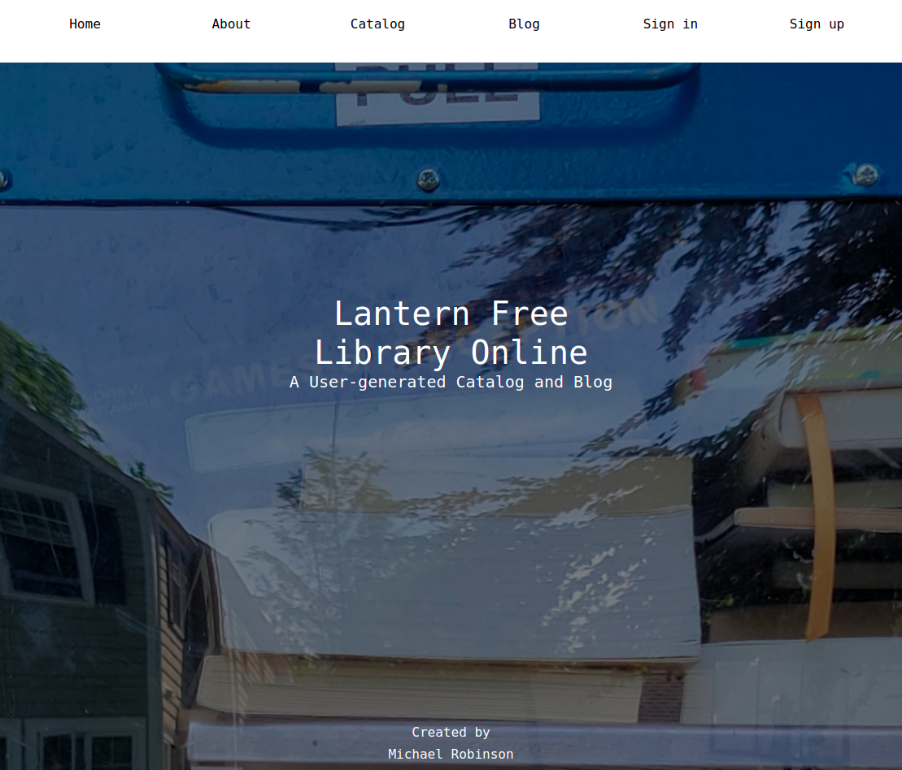
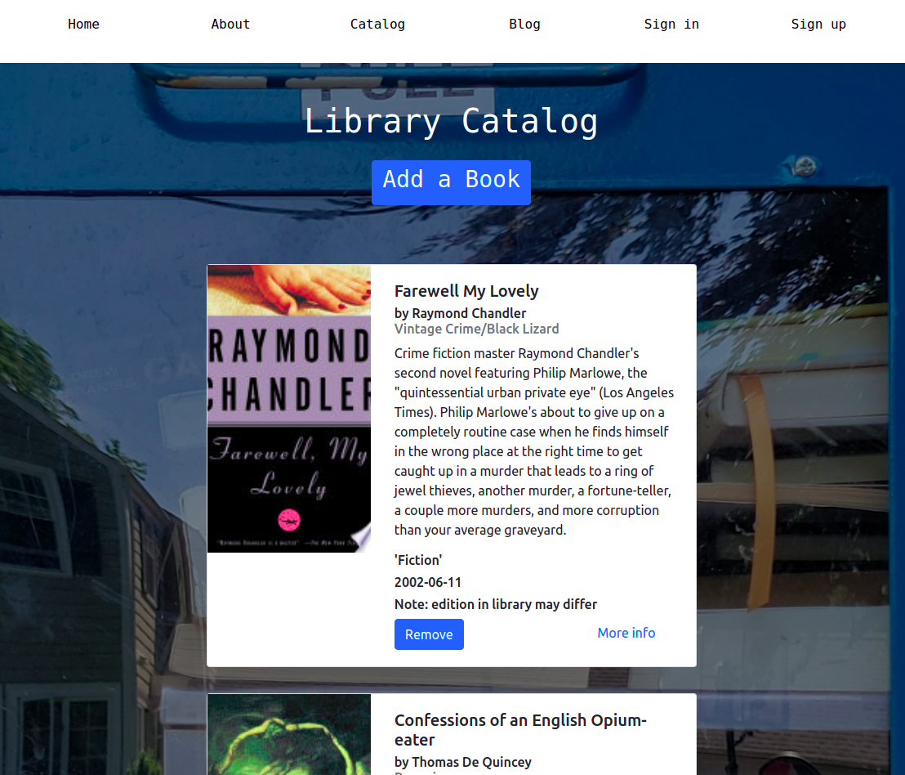
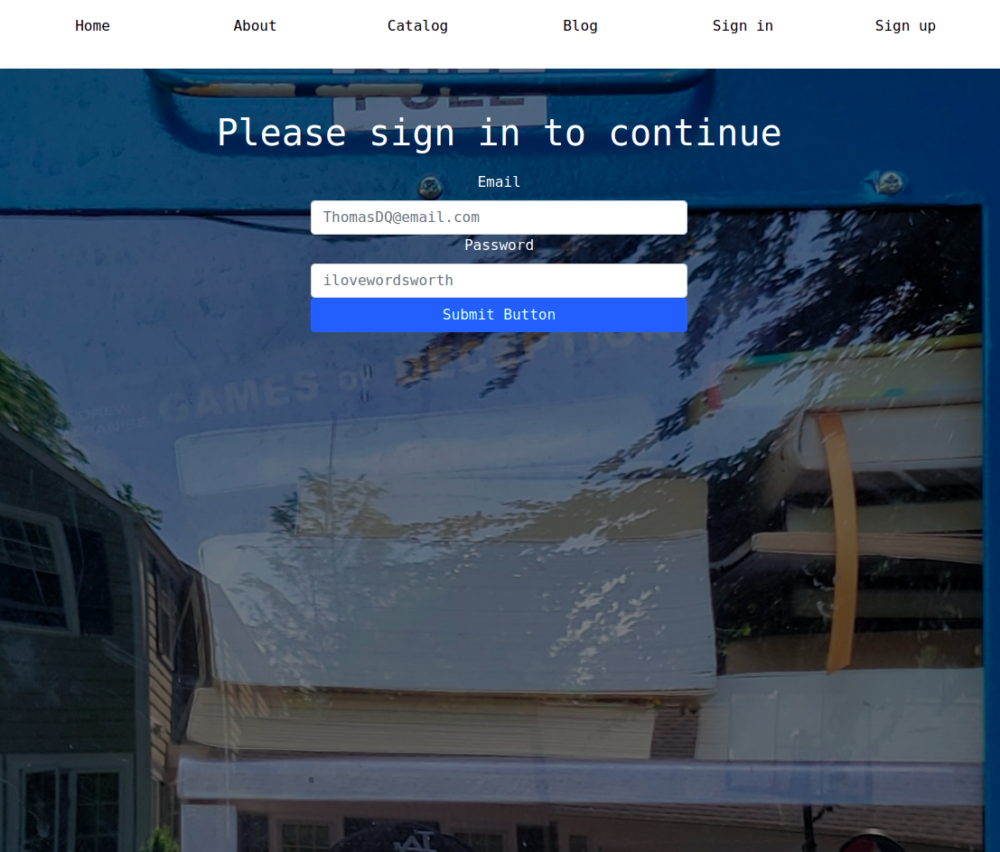
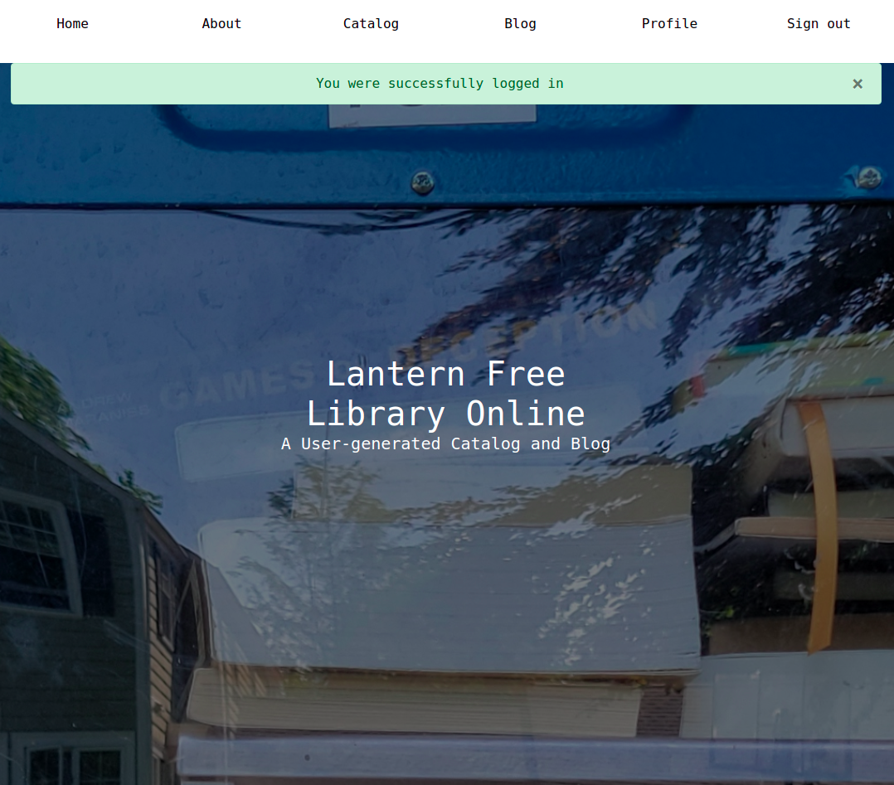

# Lantern Free Library Online

### Purpose

The Lantern Free Library Online lets users of a Little Free Library® in Rhode Island collaboratively maintain a library catalog while protecting the catalog's data integrity through an API. A blog offers library users a forum for discussing books and the cataloguing process.

NOTE: Little Free Library® is a trademark of the Little Free Library non-profit organization, which does not sponsor, authorize or endorse this app.

### Technologies

The back end of the app is in Python on a Flask framework with database support from Psycopg2 and SQLAlchemy. Python's Requests HTTP library affords access to the API, and Flask Werkzeug secures user login data. The front end employs Bootstrap4 cards to organize the records and Jinja2 templates to make the navigation dynamic. Flask Login, Flask Flash messages and Flask WTF forms round out the UI.

## Table of Contents

1. Title
2. Purpose
3. Technologies
4. Table of Contents
5. App Images

## App Images

Jinja2 templates create a dynamic top nav reflecting the user's login status and current page view. Above: the homepage view for a user prior to login.

Scrolling through Bootstrap cards mimics the experience of browsing a physical card catalog. Each record presents data enriched by the Google Books API, including a brief description, a cover image and a link to more information.

Flask Login protects certain app routes, including the form for adding a book.

Flask Flash messages inform the user of a completed login, successful catalog entry, unsuccessful API request and other events.

The forms, built using Flask WTF, feature global CSRF protection.

Catalog records display user-generated metadata (the title and author) supplemented by data from Google's API. To update the catalog after removing a book from the LFL, a user simply clicks the blue "Remove" button. 

A user's profile page contains all of that user's donations currently in the catalog, as well as all of that user's blog posts. From the profile, a user can edit book records and blog posts.

The blog presents each post's title, author, date and time.

If a user's catalog entry yields no result from a search of the API, a Flash message notifies the user and sends them to their profile, where they can add more metadata if they wish.

The form for editing a book record includes all the fields used in API requests in case a user wishes to correct any mismatches between API data and their particular edition of a book.

## License

Creative Commons BY-SA 4.0