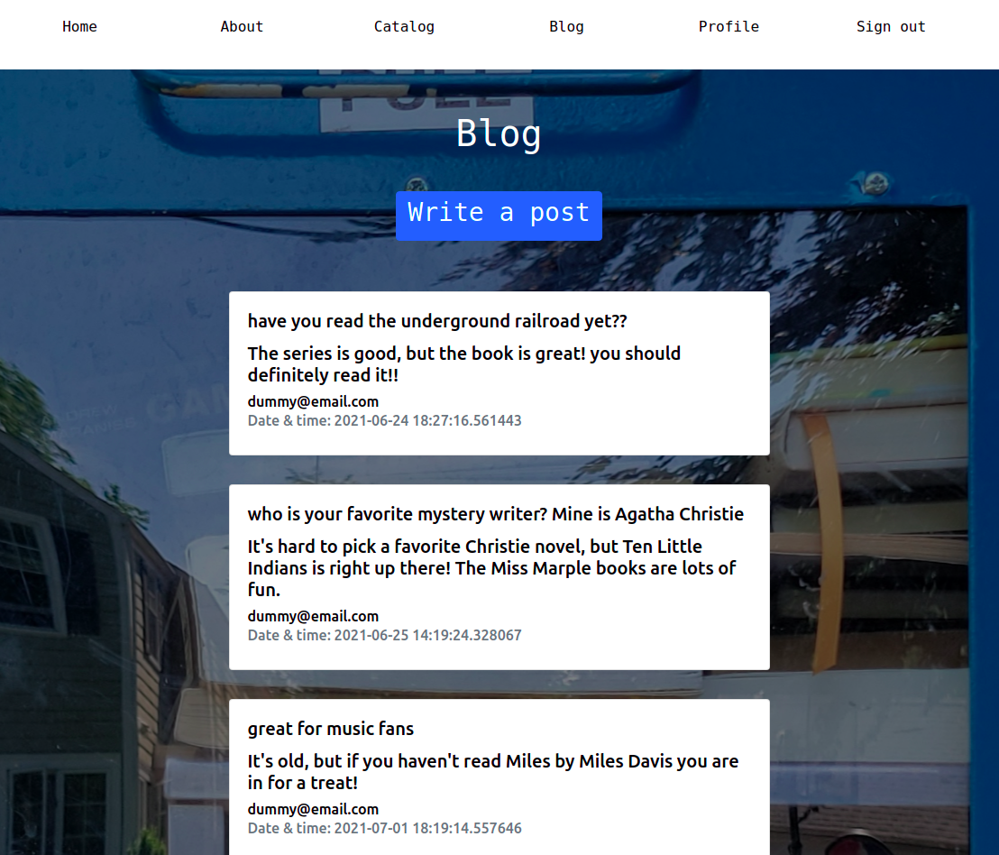

# Lantern Free Library Online

### Purpose

The Lantern Free Library Online adds to the charms of the neighborhood Little Free Library® a new way for neighbors to bond over books. In addition to making and taking donations, patrons of an LFL in Barrington, Rhode Island, can now get to know their fellow users and share a literary experience usually reserved for librarians -- the communal maintainence of a detailed catalog. This full-stack app allows for virtual collaboration on an LFL's inventory, while potentially reducing the environmental impact of trips to the library's location. The app minimizes user effort and enriches catalog data through use of an API, and a blog offers patrons a forum for exchanging book recommendations, discussing the cataloguing process, or simply getting to know one another.

NOTE: Little Free Library® is a trademark of the Little Free Library non-profit organization, which does not sponsor, authorize or endorse this app.

### Technologies

The back end of the app is in Python on a Flask framework with database support from Psycopg2 and SQLAlchemy. Python's Requests HTTP library affords access to the Google Books API, and Flask Werkzeug secures user passwords. The front end employs Bootstrap4 cards to organize records and Jinja2 templates to make the navigation user-tailored and dynamic. Flask Login, Flask Flash messages and Flask WTF forms complete the retro UI.

## Table of Contents

1. Title
2. Purpose
3. Technologies
4. Table of Contents
5. App Images

## App Images

Jinja2 templates create a dynamic top nav reflecting the user's login status and current page view. Above: the homepage view for a user prior to login.

Scrolling through Bootstrap cards mimics the experience of browsing a physical card catalog. Each record presents data enhanced by the Google Books API, including a brief description, a cover image and a link to more information.

Flask Login protects certain app routes, including the form for adding a book.

Flask Flash messages inform the user of a completed login, successful catalog entry, unsuccessful API request and other events.

The forms, built using Flask WTF, feature global CSRF protection.

Catalog records display user-generated metadata (title and author) supplemented by data from the API. To update the catalog after removing a book from the LFL, a user simply clicks the blue "Remove" button. 

A user's profile page contains all of that user's donations currently in the catalog, as well as all of that user's blog posts. From here, a user can edit book records as well as blog posts.

The blog presents each post's title, author, date and time.

If a user's catalog entry yields no result from a search of the API, a Flash message notifies the user and sends them to their profile. From there, they can add more metadata to the record if they wish.

The form for editing a book record includes all the fields used in API requests in case a user wishes to correct any mismatches between API data and their particular edition of a book.

## License

Creative Commons BY-SA 4.0